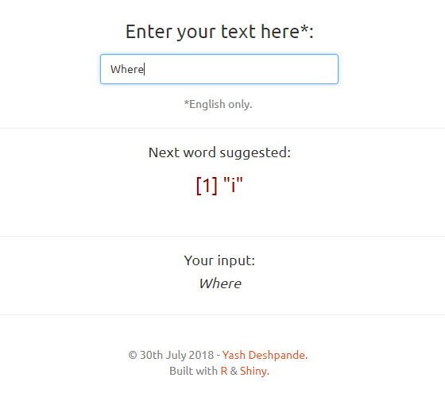

Word Prediction Application
========================================================
author: Yash Deshpande
date: 30th July, 2018
transition: fade

<small>
This presentation acts as a pitch for an [application](https://yashd94.shinyapps.io/AutoComplete/) that implements the auto-complete functionality, by taking a set of words as input from the user, and suggesting what the next word should be.
This application has been created as a culmination to the Data Science Specialization, under Coursera and Johns Hopkins University, in partnership with SwiftKey. </small>

The Objective
========================================================

The goal of this capstone project was to build a Shiny application that predicts the next word on the basis of a set of input words. 

This project leverages the various methods learnt during the course of the Coursera Data Science specialization, and is a step-by-step build of a data product. Exploratory analyses, statistical modelling, and learning techniques have been implemented using various R packages. 

Data from the corpus provided [HC Corpora](http://www.corpora.heliohost.org/) has been used to create a frequency dictionary of _n-grams_ (a set of _n_ words), and this dictionary has been used to predict the next word. 

Using the Application
========================================================

<small> Once the user enters text into the first box, as shown below, the app predicts the next word, which is then displayed in the second box below. </small>

Additional Information
========================================================
<small>
* The next word prediction app is hosted on shinyapps.io: [https://yashd94.shinyapps.io/AutoComplete/](https://yashd94.shinyapps.io/AutoComplete/)

* The code used to develop this application along with other required data can be found in the GitHub repository linked here: [https://github.com/yashd94/DS_Capstone](https://github.com/yashd94/DS_Capstone)

* The milestone report for this project can be found at: [http://rpubs.com/yashd94/399725](http://rpubs.com/yashd94/399725)

* The deck used to pitch this application can be found at: [http://rpubs.com/yashd94/CapstonePitch](http://rpubs.com/yashd94/CapstonePitch)

* You can also read more about the Coursera Data Science Specialization at: [https://www.coursera.org/specialization/jhudatascience/1](https://www.coursera.org/specialization/jhudatascience/1) 

